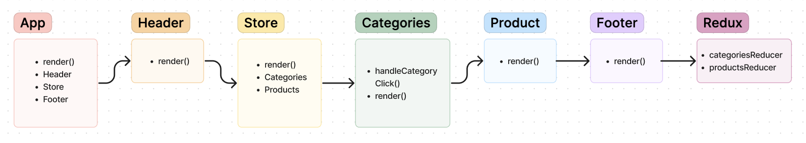

# Storefront

**Author**: Wajiha Khan

**Version**: 1.0.0

**Phase 1**:

In Phase 1, we have set up the basic structure of the e-commerce application with category-based product filtering. The application uses Redux for state management, ensuring a scalable and maintainable codebase. The UML diagram provides a visual representation of the component structure and their interactions, aiding in understanding the flow of data and user interactions.

**Version**: 2.0.0

**Phase 2**:

In this phase of developing the e-Commerce storefront, we focus on enhancing user interaction by implementing a shopping cart feature. This allows users to add items to their cart, view the items in their cart, modify quantities, and remove items. The goal is to create a seamless shopping experience with the following user stories and application flow.

**Version**: 3.0.0

**Phase 3**:

Phase 3 focuses on integrating live API data into the virtual store for persistent inventory management. This involves fetching categories and products from a remote API, updating the inventory when items are added or removed from the cart, and ensuring the application state stays synchronized with the server. The goal is to provide a seamless shopping experience where users can confidently interact with real-time inventory data.

**Render**: https://auth-api-zxfi.onrender.com